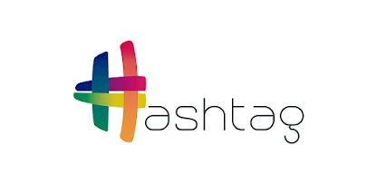

Bem-vindo ao repositório **Imersão Hashtag Python** o objetivo aqui é salvar os gabaritos dos projetos desse curso de imersão. Nesse evento eu construo 4 projetos práticos completos em Python partindo do zero.

 

**************
   

<!-- ALL-TOPICS-LIST:START -->
<!-- prettier-ignore-start -->
<!-- markdownlint-disable -->

<table>
  <tr>
    <td align="center"><a href="Aula1/"> <b>Aula1</b></a></td>
    <td align="center"><a href="Aula2/"> <b>Aula2</b></a></td>
  </tr>

  <tr>
    <td align="center"><a href="Aula3/"> <b>Aula3</b></a></td>
    <td align="center"><a href="Aula4/"> <b>Aula4</b></a></td>

  </tr>

</table>

<!-- markdownlint-enable -->
<!-- prettier-ignore-end -->
<!-- ALL-TOPICS-LIST:END -->
