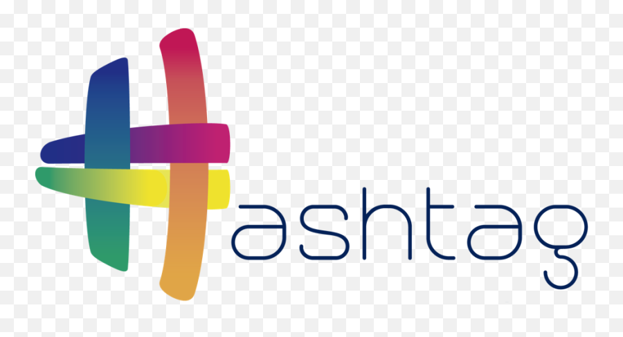
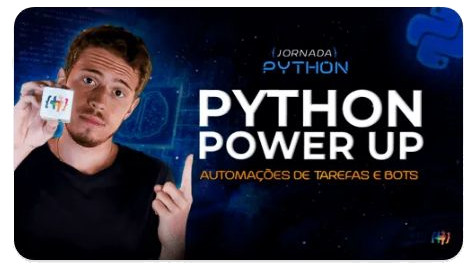
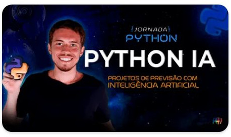
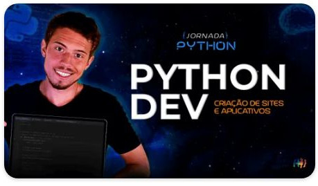

Bem-vindo ao repositório **Imersão Hashtag Python** o objetivo aqui é salvar os gabaritos dos projetos desse curso de imersão. Nesse evento eu construo 4 projetos práticos completos em Python partindo do zero.

 

## 💻 Aula 1 - Automação de tarefas e Bots

 

## 💻 Aula 2 - Python Insights

 

## 💻 Aula 3 - Projetos de previsão com IA

 

## 💻 Aula 4 - Criação de sites e aplicativos

 

